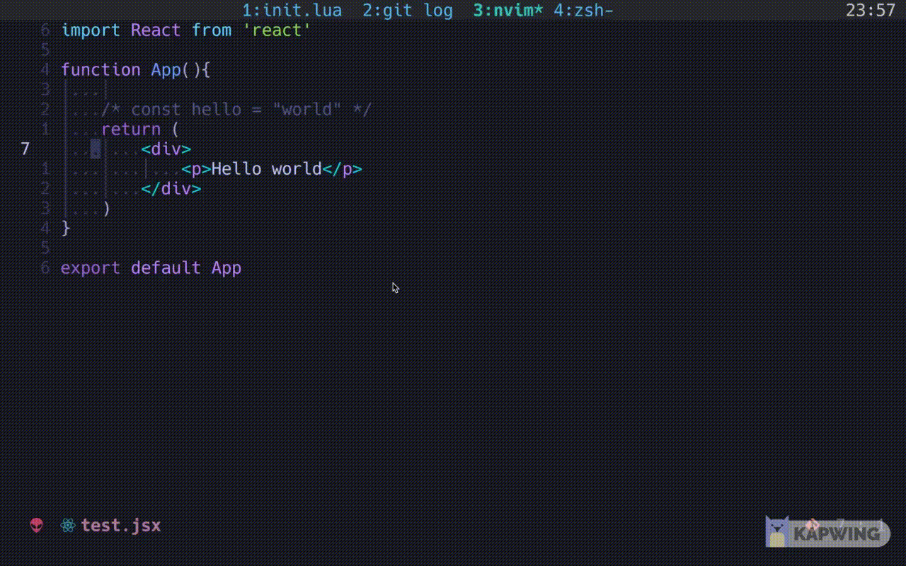
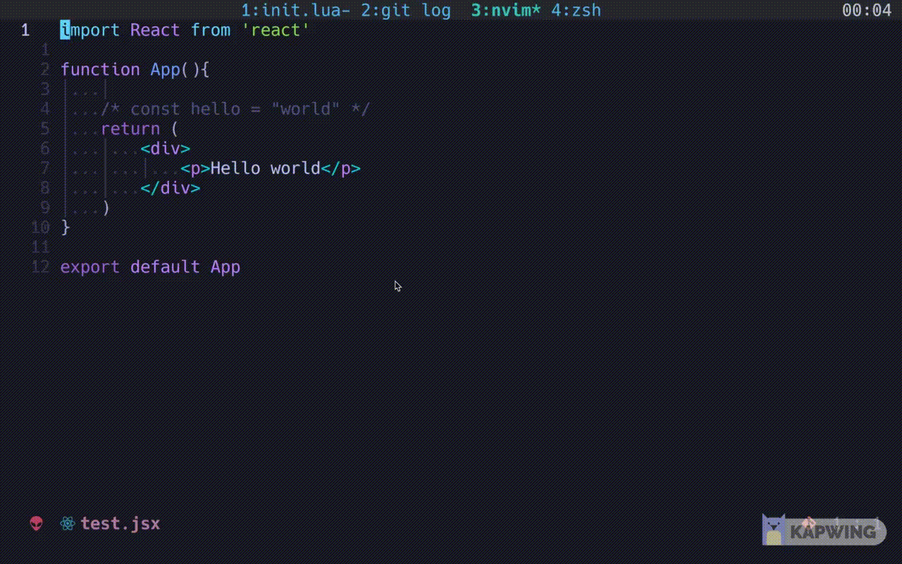

# commented.nvim

A commenting plugin written in Lua that actually works.

This plugin uses `commentstring` and custom comment definition for accurately comment and uncomment code.



## Features

- commenting lines in normal mode and visual line mode

- support **counts** for commenting in normal mode (e.g. `2<leader>c2j`, `3<leader>cc`)

- toggleable commenting command

- Handle uncommenting **multiple comment patterns(inline and block comment)** correctly

- Handle comments with various spacing correctly

- Comment ex-mode command that handles range included

## Demo

### Commenting in normal mode with count


### Commenting in virtual line mode


### Uncommenting both inline and block comment



## Why another comment plugin?

I need to comment plugin that works in normal that accepts counts and in virtual line mode. Neither does [kommentary](https://github.com/b3nj5m1n/kommentary) and [nvim-comment](https://github.com/terrortylor/nvim-comment) provide counts, therefore I decided to write one for myself.

## Installation

### `Paq.nvim`

```lua
paq{'winston0410/commented.nvim'}
```

### `vim-plug`

```lua
Plug 'winston0410/commented.nvim'
```

## Configuration

This is the default configuration.

```lua
local opts = {
	comment_padding = " ", -- padding between starting and ending comment symbols
	keybindings = {n = "<leader>c", v = "<leader>c, nl = "<leader>cc"}, -- what key to toggle comment, nl is for mapping <leader>c$, just like dd for d
	set_keybindings = true, -- whether or not keybinding is set on setup
	ex_mode_cmd = "Comment" -- command for commenting in ex-mode, set it null to not set the command initially.
}
```

You can define your own mapping with `require('commented').toggle_comment(mode)`

If you are happy with it, just call `setup()` to make it start working.

```lua
require('commented').setup()
```

## Inspiration

[kommentary](https://github.com/b3nj5m1n/kommentary)

[nvim-comment](https://github.com/terrortylor/nvim-comment)
